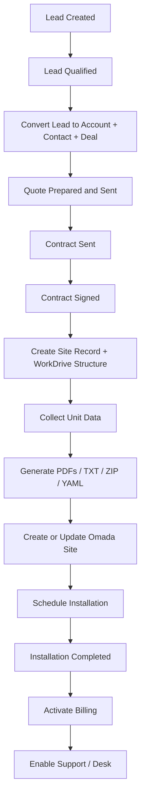

# Zoho Operating Model

This document defines the recommended Zoho operating model for the Opticable platform.

For the exact modules, fields, bilingual labels, and blueprint build order, see [zoho-crm-build-sheet.md](./zoho-crm-build-sheet.md).

It is designed to stay stable as you add:

- new client types
- new service types
- more technicians
- more provisioning automations
- more finance and support processes

## 1. Core Recommendation

Do **not** turn the `Deals` module into your long-term `Sites` module.

Best structure:

- `Deals` = sales opportunity and commercial process
- `Sites` = operational service record for the physical location

Why this is better:

- one company can have multiple sites
- one deal can create one or many sites
- the sales pipeline and the service lifecycle are different processes
- support, billing, installations, and password rotations belong to the site, not to the original sale

## 2. Best Zoho Stack For Your Use Case

### Zoho CRM

Use CRM as the operational command center for:

- leads
- accounts
- contacts
- deals
- quotes
- sites
- site units
- installations or deployment requests

### Zoho WorkDrive

Use WorkDrive as the document and generated-file repository for:

- quotes
- signed contracts
- PDFs
- TXT/ZIP exports
- `omada-plan.yaml`
- `create.yaml`
- `upsert.yaml`
- `update.yaml`
- `live-site.yaml`

### Zoho Sign

Use Zoho Sign for:

- service contracts
- building approvals
- installation approvals

### Zoho Desk

Use Desk only after service is active, for:

- support tickets
- service issues
- change requests
- post-sale communications

### Zoho Billing / Books

Recommended rule:

- if you will bill recurring monthly services, prefer **Zoho Billing** as the subscription layer
- if you mainly need accounting and one-time invoices, **Zoho Books** is enough
- if you have both recurring services and accounting, use Billing for the subscription lifecycle and your Zoho Finance setup for accounting

### Zoho FSM

If installations become technician-heavy, use **Zoho FSM** for:

- appointments
- dispatch
- work orders
- field completion

If you are still small, you can start with a custom `Installations` module in CRM and move to FSM later.

## 3. Recommended Module Structure

### Leads

Use for:

- web inquiries
- calls
- word of mouth
- referrals

Important fields:

- lead source
- service interest
- building type
- city
- contact info
- qualification status

### Accounts

Use for:

- property owners
- building management companies
- business customers
- condo boards
- partners

Important fields:

- account type
- billing details
- support tier
- finance customer id

### Contacts

Use for:

- primary building contact
- manager
- billing contact
- technical contact
- signer

### Deals

Use for:

- sales pipeline
- quoting
- negotiation
- commercial approval
- contract progress

Important fields:

- account
- contact
- quote status
- contract status
- estimated close date
- deal value
- site count
- service type

### Quotes

Use for:

- proposal documents
- accepted commercial terms
- handoff into contract

### Sites

This should be your main operational module.

Use for:

- one physical building or service location
- the service delivery lifecycle
- API provisioning state
- billing readiness
- support readiness

Important fields:

- site name
- civic address
- city
- province/state
- postal code
- linked account
- linked primary contact
- linked originating deal
- service type
- service status
- implementation stage
- WorkDrive parent folder id
- latest current document folder link
- Zoho Sign status
- Omada site id
- last Omada operation
- last workflow job id
- latest `live-site.yaml` file link
- activation date
- billing customer id
- billing subscription id
- desk enabled yes/no

### Site Units

Use a separate custom module for units instead of one text blob in the Site record.

Use for:

- apartment/unit/suite rows
- one SSID per unit
- one password per unit
- one VLAN per unit
- per-unit provisioning status

Important fields:

- linked site
- unit label
- SSID
- password
- VLAN
- hidden SSID
- credential source
- last generated at
- last applied at
- active yes/no

This is more future-proof than putting units into one multiline field.

### Installations

Use either:

- a custom CRM module at first
- or Zoho FSM work orders later

Important fields:

- linked site
- installation type
- scheduled date
- assigned technician
- install status
- completion notes
- completion proof

## 4. Recommended Stage Model

### Lead Stages

- New
- Contacted
- Qualified
- Quote Requested
- Converted
- Disqualified

### Deal Stages

- Qualification
- Survey / Discovery
- Quote Preparation
- Quote Sent
- Negotiation
- Contract Sent
- Contract Signed
- Won
- Lost

Important recommendation:

- do not wait until final operational delivery to keep the record in Deals
- once the sale is commercially won or contract-signed, create the Site record and let operations run from there

### Site Stages

- Intake
- WorkDrive Ready
- Contract Pending
- Contract Signed
- Units Pending
- Ready For Provisioning
- Provisioning In Progress
- Provisioned
- Scheduled
- Installation In Progress
- Installed
- Billing Ready
- Active
- Support
- Suspended
- Cancelled

### Installation Stages

- Requested
- Scheduled
- Technician Assigned
- In Progress
- Completed
- Failed / Revisit Required

## 5. Recommended Business Flow



## 6. Best Automation Design

### Lead automation

Trigger:

- when a lead becomes qualified

Action:

- convert lead into account + contact + deal

### Deal automation

Trigger:

- when deal reaches `Contract Signed` or `Won`

Action:

- create Site record
- create WorkDrive building folder
- optionally send Sign package if not already sent
- link deal to site

### Site automation

Trigger examples:

- stage becomes `Ready For Provisioning`
- stage becomes `Password Rotation Requested`
- stage becomes `Apply WorkDrive Plan`

Action:

- call `POST /v1/workflows/site-and-password`
- or call `POST /v1/omada/workdrive/jobs`

### Installation automation

Trigger:

- scheduled / completed

Action:

- update Site stage
- store technician notes
- on completion, move site to `Billing Ready` or `Active`

### Billing automation

Trigger:

- site stage becomes `Billing Ready`

Action:

- create or activate customer/subscription
- store billing ids back in Site

### Support automation

Trigger:

- site stage becomes `Active`

Action:

- mark support enabled
- sync account/contact/product context to Desk

## 7. Where To Use The API

### Use `POST /v1/workflows/site-and-password`

From:

- Site record
- Site Units workflow
- Deal handoff workflow

Use it for:

- generated SSIDs/passwords
- predefined SSIDs/passwords
- PDF generation
- WorkDrive upload
- Omada create/upsert/update

### Use `POST /v1/omada/workdrive/jobs`

From:

- Site record
- operator button
- remediation flow

Use it for:

- applying `create.yaml`
- applying `upsert.yaml`
- applying `update.yaml`
- using TXT fallback when YAML is missing

### Use Omada GET endpoints

From:

- admin buttons
- audit functions
- support tools

Use them for:

- resolving `site_id`
- reading VLANs
- reading WLAN groups
- reading SSIDs
- exporting live snapshots

## 8. Best Deluge Placement By Module

### In Leads

Use Deluge for:

- qualification checks
- lead conversion

Suggested function:

- `convert_qualified_lead(lead_id)`

### In Deals

Use Deluge for:

- site creation handoff
- WorkDrive folder setup
- Sign initiation

Suggested functions:

- `initialize_site_from_deal(deal_id)`
- `send_contract_from_deal(deal_id)`

### In Sites

Use Deluge for:

- generate docs
- create Omada
- update passwords
- apply WorkDrive YAML
- fetch live snapshot

Suggested functions:

- `site_generate_docs_and_create(site_id)`
- `site_rotate_passwords(site_id)`
- `site_apply_workdrive_plan(site_id, operation)`
- `site_fetch_live_snapshot(site_id)`

### In Installations

Use Deluge for:

- stage transitions
- completion updates
- triggering billing readiness

Suggested functions:

- `mark_installation_scheduled(installation_id)`
- `mark_installation_completed(installation_id)`

## 9. Recommended Deluge Wrappers

These wrappers assume the helpers from [zoho-deluge-handbook.md](./zoho-deluge-handbook.md).

### A. Convert a qualified lead

```deluge
convert_qualified_lead(lead_id)
{
	lead = zoho.crm.getRecordById("Leads",lead_id.toLong());
	deal_values = Map();
	deal_values.put("Deal_Name",ifnull(lead.get("Company"),lead.get("Last_Name")));
	deal_values.put("Stage","Qualification");
	deal_values.put("Closing_Date",zoho.currentdate.addDay(14));

	response = zoho.crm.convertLead(lead_id.toLong(),{"Deals":deal_values});
	return response;
}
```

### B. Initialize site from a won or signed deal

```deluge
initialize_site_from_deal(deal_id)
{
	deal = zoho.crm.getRecordById("Deals",deal_id.toLong());

	site = Map();
	site.put("Site_Name",deal.get("Deal_Name"));
	site.put("Linked_Deal",deal_id.toLong());
	site.put("Stage","Intake");
	site.put("Account_Name",deal.get("Account_Name"));

	response = zoho.crm.createRecord("Sites",site);
	return response;
}
```

### C. Generate PDFs and create site from Site module

```deluge
site_generate_docs_and_create(site_id)
{
	site = zoho.crm.getRecordById("Sites",site_id.toLong());
	unit_rows = zoho.crm.getRelatedRecords("Site_Units","Sites",site_id.toLong());

	payload = Map();
	payload.put("building_name",site.get("Site_Name"));
	payload.put("site_name",site.get("Site_Name"));
	payload.put("credential_mode","generated");
	payload.put("workflow_mode","pdf_and_site");
	payload.put("omada_operation","create");
	payload.put("template_name","Opticable_Template_01");
	payload.put("workdrive_folder_id",site.get("WorkDrive_Folder_Id"));

	units = List();
	for each unit_row in unit_rows
	{
		units.add(unit_row.get("Unit_Label"));
	}
	payload.put("units",units);

	response = opticable_post("/v1/workflows/site-and-password",payload);
	return response;
}
```

### D. Rotate passwords on an existing site

```deluge
site_rotate_passwords(site_id)
{
	site = zoho.crm.getRecordById("Sites",site_id.toLong());
	unit_rows = zoho.crm.getRelatedRecords("Site_Units","Sites",site_id.toLong());

	payload = Map();
	payload.put("building_name",site.get("Site_Name"));
	payload.put("site_name",site.get("Site_Name"));
	payload.put("credential_mode","generated");
	payload.put("workflow_mode","pdf_and_site");
	payload.put("omada_operation","update");
	payload.put("template_name","Opticable_Template_01");
	payload.put("workdrive_folder_id",site.get("WorkDrive_Folder_Id"));

	units = List();
	for each unit_row in unit_rows
	{
		units.add(unit_row.get("Unit_Label"));
	}
	payload.put("units",units);

	response = opticable_post("/v1/workflows/site-and-password",payload);
	return response;
}
```

### E. Apply WorkDrive YAML or TXT directly

```deluge
site_apply_workdrive_plan(site_id,operation_value)
{
	site = zoho.crm.getRecordById("Sites",site_id.toLong());

	payload = Map();
	payload.put("workdrive_folder_id",site.get("WorkDrive_Folder_Id"));
	payload.put("operation",operation_value);
	payload.put("source_preference","yaml_then_txt");
	payload.put("building_name",site.get("Site_Name"));
	payload.put("site_name",site.get("Site_Name"));

	response = opticable_post("/v1/omada/workdrive/jobs",payload);
	return response;
}
```

### F. Fetch current Omada snapshot

```deluge
site_fetch_live_snapshot(site_id)
{
	site = zoho.crm.getRecordById("Sites",site_id.toLong());
	omada_site_id = site.get("Omada_Site_Id");
	response = opticable_get("/v1/omada/sites/" + omada_site_id + "/snapshot?format=yaml");
	return response;
}
```

## 10. Recommended Future-Proofing

To support different client types later:

- keep `Accounts` generic
- keep `Sites` as physical service locations
- keep `Site Units` as optional child records
- use `service_type` and `client_type` picklists everywhere

Suggested `client_type` values:

- Residential Building
- Commercial Building
- Condo / HOA
- Direct Residential
- Business Customer
- Partner / Reseller

Suggested `service_type` values:

- Managed WiFi
- Internet Access
- IPTV
- VoIP
- Camera / Security
- Guest WiFi
- Network Support

This lets the same CRM model survive future expansion without renaming modules later.

## 11. Final Recommendation

Best stable design:

- keep sales in `Deals`
- keep delivery in `Sites`
- keep per-unit data in `Site Units`
- keep documents in WorkDrive
- keep signatures in Sign
- keep recurring billing in Billing
- keep support in Desk
- move scheduling/dispatch into FSM when field work becomes busy

That is cleaner, more integrated, and more scalable than trying to make one Deal record hold the entire lifetime of the site.

## 12. What To Build First In CRM

Build this in order.

### Step 1: Standard modules to keep

Keep and actively use:

- `Leads`
- `Accounts`
- `Contacts`
- `Deals`
- `Quotes`
- `Tasks`
- `Calls`
- `Meetings`

### Step 2: Custom modules to create

Create these custom modules first:

- `Sites`
- `Site Units`
- `Installations`

If you want a place for post-signoff commercial change requests later, add:

- `Service Changes`

### Step 3: Critical fields in `Deals`

Create or confirm these fields:

- `Deal_Type`
- `Service_Type`
- `Client_Type`
- `Quoted_Units`
- `Contract_Status`
- `Quote_Status`
- `Sign_Request_Id`
- `Primary_WorkDrive_Folder_Id`
- `Primary_Site_Count`
- `Won_Date`

### Step 4: Critical fields in `Sites`

Create these fields:

- `Site_Name`
- `Building_Name`
- `Street_Address`
- `City`
- `Province`
- `Postal_Code`
- `Country`
- `Linked_Deal`
- `Linked_Account`
- `Primary_Contact`
- `Service_Type`
- `Client_Type`
- `Implementation_Stage`
- `Operational_Status`
- `WorkDrive_Folder_Id`
- `Current_Document_Folder_Link`
- `Zoho_Sign_Status`
- `Omada_Site_Id`
- `Last_Omada_Operation`
- `Last_Workflow_Job_Id`
- `Last_Omada_Job_Id`
- `Live_Site_Yaml_Link`
- `Activation_Date`
- `Billing_Status`
- `Billing_Customer_Id`
- `Billing_Subscription_Id`
- `Desk_Enabled`

### Step 5: Critical fields in `Site Units`

Create these fields:

- `Linked_Site`
- `Unit_Label`
- `SSID`
- `Password`
- `VLAN`
- `Hidden`
- `Credential_Source`
- `Provisioning_Status`
- `Last_Generated_At`
- `Last_Applied_At`
- `Active`

### Step 6: Critical fields in `Installations`

Create these fields:

- `Linked_Site`
- `Installation_Type`
- `Scheduled_Date`
- `Assigned_Technician`
- `Installation_Status`
- `Technician_Notes`
- `Completion_Proof_Link`
- `Completed_At`

## 13. Which Automation Tool To Use

Use the simplest tool that is stable for the job.

### Use CRM Workflow Rules when

- the trigger starts from a CRM record create/edit
- the criteria are easy to describe
- the next action is a field update, task, email, webhook, function, create record, owner assignment, or Flow action

Zoho documents that workflow rules support actions such as field updates, webhooks, functions, create record, owner assignment, and Actions by Zoho Flow.[^workflow-rules][^automatic-actions]

Use CRM Workflow Rules for:

- create Site after Deal becomes `Contract Signed` or `Won`
- call a function when Site stage becomes `Ready For Provisioning`
- call a function when Site stage becomes `Password Rotation Requested`
- create follow-up tasks
- schedule reminders

### Use CRM Functions when

- the logic is custom
- you need to call the Opticable API
- you need to update several CRM records together
- you need to decide between multiple paths

Use CRM Functions as the main automation engine for:

- building payloads for the Opticable API
- creating WorkDrive folder structures
- syncing returned job IDs and Omada IDs back into CRM
- creating child `Site Units` from CRM data

### Use CRM Webhooks when

- you only need a simple one-way call
- you do not need much logic inside CRM first

For your business, direct raw webhooks should be used sparingly.

Best use:

- simple fire-and-forget notifications

Do **not** make raw webhooks the core orchestration layer if the payload needs preparation, branching, retries, or CRM updates after the response.

### Use Blueprint when

- humans must follow a controlled stage process
- transitions should require mandatory fields, tasks, checklists, approvals, or confirmations
- you want stage discipline

Zoho Blueprint is built from `States` and `Transitions`, and transitions control how a record moves from one state to another.[^blueprint]

Use Blueprint on:

- `Deals`
- `Sites`
- `Installations`

Recommended:

- `Deals Blueprint` for commercial process
- `Sites Blueprint` for operations/provisioning process
- `Installations Blueprint` for scheduling/completion process

Do **not** put everything into one giant Blueprint.

### Use Approval Processes when

- a human approval is genuinely required
- the record should be locked pending approval

Zoho approval processes are appropriate for approvals such as budgets, invoices, discounts, payments, and similar controlled decisions.[^approval]

Use Approval Process for:

- non-standard discounts
- high-value deals
- contract exceptions
- unusual write-offs or billing exceptions

Do not use Approval Process for normal operational stage changes.

### Use Zoho Flow when

- the trigger is outside CRM
- multiple apps need to be connected with low-code steps
- the logic is mainly app-to-app routing

Zoho Flow is best thought of as an integration layer with triggers and actions across apps.[^flow][^flow-actions]

Use Flow for:

- Desk event -> CRM signal or task
- Sign completed -> CRM update if native CRM automation is awkward
- Billing event -> CRM status sync
- external form or external tool -> CRM record creation

Do **not** put the core provisioning logic only in Flow.

Best pattern:

- CRM decides the business state
- CRM Function calls the Opticable API
- Flow handles cross-app event routing where needed

### Use native Billing/Books automation when

- the event belongs to finance
- the system of record should be Billing or Books

Best pattern:

- subscription lifecycle lives in Zoho Billing
- important finance status is written back to CRM

Do not try to make CRM the finance engine.

### Use Desk automation when

- the event belongs to support
- SLA, assignment, and ticket behavior belong inside Desk

Best pattern:

- Desk manages tickets
- CRM stores the commercial and site context
- important ticket events can raise a CRM signal or update a Site support field

## 14. Concrete Blueprint Design

### Deal Blueprint

Create one Blueprint on `Deals`.

States:

- Qualification
- Survey / Discovery
- Quote Preparation
- Quote Sent
- Negotiation
- Contract Sent
- Contract Signed
- Won
- Lost

Key transitions:

- `Prepare Quote`
- `Send Quote`
- `Send Contract`
- `Mark Contract Signed`
- `Mark Won`
- `Mark Lost`

Use Blueprint rules to require:

- quote attachment before `Quote Sent`
- sign request id before `Contract Sent`
- signed contract reference before `Contract Signed`

After transition `Contract Signed`:

- trigger a CRM Function
- create Site
- create WorkDrive structure
- copy key values from Deal to Site

### Site Blueprint

Create one Blueprint on `Sites`.

States:

- Intake
- WorkDrive Ready
- Contract Signed
- Units Pending
- Ready For Provisioning
- Provisioning In Progress
- Provisioned
- Scheduled
- Installation In Progress
- Installed
- Billing Ready
- Active
- Support
- Suspended
- Cancelled

Key transitions:

- `Prepare WorkDrive`
- `Collect Units`
- `Generate Docs`
- `Provision Site`
- `Schedule Install`
- `Mark Installed`
- `Mark Billing Ready`
- `Activate Service`

Recommended automation:

- `Generate Docs` transition -> CRM Function -> `POST /v1/workflows/site-and-password`
- `Provision Site` transition -> CRM Function -> either workflow endpoint or `/v1/omada/workdrive/jobs`
- `Mark Installed` transition -> update install completion fields
- `Mark Billing Ready` transition -> trigger billing creation

### Installation Blueprint

Create one Blueprint on `Installations`.

States:

- Requested
- Scheduled
- Technician Assigned
- In Progress
- Completed
- Failed / Revisit Required

Use this Blueprint to force:

- assigned technician before scheduling
- completion notes before completed
- revisit reason before failure

## 15. Concrete Automation Map

### A. Lead qualified

Trigger type:

- CRM Workflow Rule

Action:

- CRM Function `convert_qualified_lead`

Result:

- create Account
- create Contact
- create Deal

### B. Deal contract signed

Trigger type:

- Deal Blueprint transition or CRM Workflow Rule on stage change

Action:

- CRM Function `initialize_site_from_deal`

Result:

- create Site
- create WorkDrive parent folder
- store WorkDrive folder id on Site
- optionally pre-create `Site Units` skeleton rows

### C. Site ready for provisioning

Trigger type:

- Site Blueprint transition

Action:

- CRM Function `site_generate_docs_and_create`

Result:

- generate PDFs
- upload to WorkDrive
- write operation YAMLs
- create or update Omada site
- store returned job IDs back in Site

### D. Password rotation requested

Trigger type:

- Site Blueprint transition
- or button on Site record

Action:

- CRM Function `site_rotate_passwords`

Result:

- generate new passwords
- update PDFs and TXT
- update Omada with `omada_operation=update`
- refresh `live-site.yaml`

### E. Apply operator-prepared YAML from WorkDrive

Trigger type:

- button on Site record
- or specific Site stage such as `Apply WorkDrive Plan`

Action:

- CRM Function `site_apply_workdrive_plan(site_id,operation)`

Result:

- read `create.yaml`, `upsert.yaml`, or `update.yaml`
- execute directly

### F. Installation completed

Trigger type:

- Installation Blueprint transition

Action:

- CRM Function or simple workflow field updates

Result:

- mark Site as `Billing Ready`
- optionally notify finance

### G. Billing activated

Trigger type:

- Billing event

Best tool:

- Zoho Flow or finance-side automation

Result:

- write billing subscription id and active status back to Site
- move Site to `Active`

### H. First support ticket

Trigger type:

- Desk event

Best tool:

- Zoho Flow + CRM Signal

Result:

- raise a CRM signal
- optionally create a task or update support status on Site

## 16. Best Simple-But-Scalable Rule Set

If you want to keep the business simple and still scalable, use this rule set:

### Rule 1

`CRM` is the main system of record.

### Rule 2

`Deals` own the sale.

### Rule 3

`Sites` own delivery, provisioning, billing readiness, and support readiness.

### Rule 4

`Site Units` own per-unit WiFi data.

### Rule 5

`WorkDrive` owns files.

### Rule 6

`CRM Functions` own core business logic and API calls.

### Rule 7

`Blueprints` own human stage discipline.

### Rule 8

`Zoho Flow` is used only where app-to-app routing is the right tool, not as the core business brain.

### Rule 9

`Billing` owns recurring billing lifecycle.

### Rule 10

`Desk` owns support lifecycle.

## 17. What I Would Actually Implement First

If I were building your business in Zoho right now, I would do this first:

1. Create the `Sites`, `Site Units`, and `Installations` modules.
2. Add the critical fields listed above.
3. Build one `Deals Blueprint`.
4. Build one `Sites Blueprint`.
5. Build CRM Functions that call the Opticable API.
6. Add CRM Workflow Rules only for the obvious record-based triggers.
7. Keep Zoho Flow limited to cross-app status sync.
8. Add Billing integration after provisioning is stable.
9. Add Desk integration after active sites start generating support volume.
10. Add FSM only when technician scheduling becomes painful in CRM.

This is the most stable sequence with the least unnecessary complexity.

## 18. Final Answer To The Tooling Question

Do **not** use only Zoho Flow.

Do **not** put everything in CRM Workflows either.

Best mix:

- `Blueprint` for controlled stage movement
- `Workflow Rules` for record-based triggers
- `CRM Functions` for real business logic and API calls
- `Zoho Flow` for cross-app routing
- `Approval Process` only where approvals are truly needed
- `Billing/Books/Desk` native automation for their own domains, with status pushed back into CRM

That is the simplest model that will still scale cleanly.

[^workflow-rules]: [Zoho CRM workflow rules](https://help.zoho.com/portal/en/kb/crm/automate-business-processes/workflow-management/articles/configuring-workflow-rules)
[^automatic-actions]: [Zoho CRM automatic actions](https://help.zoho.com/portal/en/kb/crm/automate-business-processes/actions/articles/creating-actions-in-workflow-rules)
[^flow-actions]: [Actions by Zoho Flow in CRM](https://help.zoho.com/portal/en/kb/crm/automate-business-processes/actions/articles/actions-by-zoho-flow)
[^flow]: [Zoho Flow overview](https://www.zoho.com/flow/features/triggers.html)
[^blueprint]: [Zoho CRM Blueprint overview](https://www.zoho.com/crm/tutorials/blueprint/overview.html)
[^approval]: [Zoho CRM Approval Process overview](https://www.zoho.com/crm/tutorials/approval-process/overview.html)
