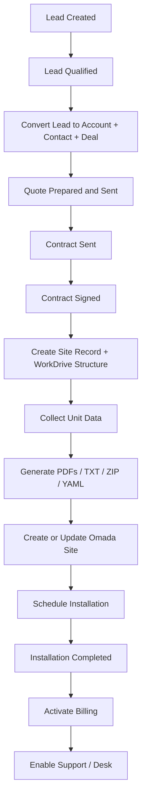

# Zoho Operating Model

This document defines the recommended Zoho operating model for the Opticable platform.

It is designed to stay stable as you add:

- new client types
- new service types
- more technicians
- more provisioning automations
- more finance and support processes

## 1. Core Recommendation

Do **not** turn the `Deals` module into your long-term `Sites` module.

Best structure:

- `Deals` = sales opportunity and commercial process
- `Sites` = operational service record for the physical location

Why this is better:

- one company can have multiple sites
- one deal can create one or many sites
- the sales pipeline and the service lifecycle are different processes
- support, billing, installations, and password rotations belong to the site, not to the original sale

## 2. Best Zoho Stack For Your Use Case

### Zoho CRM

Use CRM as the operational command center for:

- leads
- accounts
- contacts
- deals
- quotes
- sites
- site units
- installations or deployment requests

### Zoho WorkDrive

Use WorkDrive as the document and generated-file repository for:

- quotes
- signed contracts
- PDFs
- TXT/ZIP exports
- `omada-plan.yaml`
- `create.yaml`
- `upsert.yaml`
- `update.yaml`
- `live-site.yaml`

### Zoho Sign

Use Zoho Sign for:

- service contracts
- building approvals
- installation approvals

### Zoho Desk

Use Desk only after service is active, for:

- support tickets
- service issues
- change requests
- post-sale communications

### Zoho Billing / Books

Recommended rule:

- if you will bill recurring monthly services, prefer **Zoho Billing** as the subscription layer
- if you mainly need accounting and one-time invoices, **Zoho Books** is enough
- if you have both recurring services and accounting, use Billing for the subscription lifecycle and your Zoho Finance setup for accounting

### Zoho FSM

If installations become technician-heavy, use **Zoho FSM** for:

- appointments
- dispatch
- work orders
- field completion

If you are still small, you can start with a custom `Installations` module in CRM and move to FSM later.

## 3. Recommended Module Structure

### Leads

Use for:

- web inquiries
- calls
- word of mouth
- referrals

Important fields:

- lead source
- service interest
- building type
- city
- contact info
- qualification status

### Accounts

Use for:

- property owners
- building management companies
- business customers
- condo boards
- partners

Important fields:

- account type
- billing details
- support tier
- finance customer id

### Contacts

Use for:

- primary building contact
- manager
- billing contact
- technical contact
- signer

### Deals

Use for:

- sales pipeline
- quoting
- negotiation
- commercial approval
- contract progress

Important fields:

- account
- contact
- quote status
- contract status
- estimated close date
- deal value
- site count
- service type

### Quotes

Use for:

- proposal documents
- accepted commercial terms
- handoff into contract

### Sites

This should be your main operational module.

Use for:

- one physical building or service location
- the service delivery lifecycle
- API provisioning state
- billing readiness
- support readiness

Important fields:

- site name
- civic address
- city
- province/state
- postal code
- linked account
- linked primary contact
- linked originating deal
- service type
- service status
- implementation stage
- WorkDrive parent folder id
- latest current document folder link
- Zoho Sign status
- Omada site id
- last Omada operation
- last workflow job id
- latest `live-site.yaml` file link
- activation date
- billing customer id
- billing subscription id
- desk enabled yes/no

### Site Units

Use a separate custom module for units instead of one text blob in the Site record.

Use for:

- apartment/unit/suite rows
- one SSID per unit
- one password per unit
- one VLAN per unit
- per-unit provisioning status

Important fields:

- linked site
- unit label
- SSID
- password
- VLAN
- hidden SSID
- credential source
- last generated at
- last applied at
- active yes/no

This is more future-proof than putting units into one multiline field.

### Installations

Use either:

- a custom CRM module at first
- or Zoho FSM work orders later

Important fields:

- linked site
- installation type
- scheduled date
- assigned technician
- install status
- completion notes
- completion proof

## 4. Recommended Stage Model

### Lead Stages

- New
- Contacted
- Qualified
- Quote Requested
- Converted
- Disqualified

### Deal Stages

- Qualification
- Survey / Discovery
- Quote Preparation
- Quote Sent
- Negotiation
- Contract Sent
- Contract Signed
- Won
- Lost

Important recommendation:

- do not wait until final operational delivery to keep the record in Deals
- once the sale is commercially won or contract-signed, create the Site record and let operations run from there

### Site Stages

- Intake
- WorkDrive Ready
- Contract Pending
- Contract Signed
- Units Pending
- Ready For Provisioning
- Provisioning In Progress
- Provisioned
- Scheduled
- Installation In Progress
- Installed
- Billing Ready
- Active
- Support
- Suspended
- Cancelled

### Installation Stages

- Requested
- Scheduled
- Technician Assigned
- In Progress
- Completed
- Failed / Revisit Required

## 5. Recommended Business Flow



## 6. Best Automation Design

### Lead automation

Trigger:

- when a lead becomes qualified

Action:

- convert lead into account + contact + deal

### Deal automation

Trigger:

- when deal reaches `Contract Signed` or `Won`

Action:

- create Site record
- create WorkDrive building folder
- optionally send Sign package if not already sent
- link deal to site

### Site automation

Trigger examples:

- stage becomes `Ready For Provisioning`
- stage becomes `Password Rotation Requested`
- stage becomes `Apply WorkDrive Plan`

Action:

- call `POST /v1/workflows/site-and-password`
- or call `POST /v1/omada/workdrive/jobs`

### Installation automation

Trigger:

- scheduled / completed

Action:

- update Site stage
- store technician notes
- on completion, move site to `Billing Ready` or `Active`

### Billing automation

Trigger:

- site stage becomes `Billing Ready`

Action:

- create or activate customer/subscription
- store billing ids back in Site

### Support automation

Trigger:

- site stage becomes `Active`

Action:

- mark support enabled
- sync account/contact/product context to Desk

## 7. Where To Use The API

### Use `POST /v1/workflows/site-and-password`

From:

- Site record
- Site Units workflow
- Deal handoff workflow

Use it for:

- generated SSIDs/passwords
- predefined SSIDs/passwords
- PDF generation
- WorkDrive upload
- Omada create/upsert/update

### Use `POST /v1/omada/workdrive/jobs`

From:

- Site record
- operator button
- remediation flow

Use it for:

- applying `create.yaml`
- applying `upsert.yaml`
- applying `update.yaml`
- using TXT fallback when YAML is missing

### Use Omada GET endpoints

From:

- admin buttons
- audit functions
- support tools

Use them for:

- resolving `site_id`
- reading VLANs
- reading WLAN groups
- reading SSIDs
- exporting live snapshots

## 8. Best Deluge Placement By Module

### In Leads

Use Deluge for:

- qualification checks
- lead conversion

Suggested function:

- `convert_qualified_lead(lead_id)`

### In Deals

Use Deluge for:

- site creation handoff
- WorkDrive folder setup
- Sign initiation

Suggested functions:

- `initialize_site_from_deal(deal_id)`
- `send_contract_from_deal(deal_id)`

### In Sites

Use Deluge for:

- generate docs
- create Omada
- update passwords
- apply WorkDrive YAML
- fetch live snapshot

Suggested functions:

- `site_generate_docs_and_create(site_id)`
- `site_rotate_passwords(site_id)`
- `site_apply_workdrive_plan(site_id, operation)`
- `site_fetch_live_snapshot(site_id)`

### In Installations

Use Deluge for:

- stage transitions
- completion updates
- triggering billing readiness

Suggested functions:

- `mark_installation_scheduled(installation_id)`
- `mark_installation_completed(installation_id)`

## 9. Recommended Deluge Wrappers

These wrappers assume the helpers from [zoho-deluge-handbook.md](./zoho-deluge-handbook.md).

### A. Convert a qualified lead

```deluge
convert_qualified_lead(lead_id)
{
	lead = zoho.crm.getRecordById("Leads",lead_id.toLong());
	deal_values = Map();
	deal_values.put("Deal_Name",ifnull(lead.get("Company"),lead.get("Last_Name")));
	deal_values.put("Stage","Qualification");
	deal_values.put("Closing_Date",zoho.currentdate.addDay(14));

	response = zoho.crm.convertLead(lead_id.toLong(),{"Deals":deal_values});
	return response;
}
```

### B. Initialize site from a won or signed deal

```deluge
initialize_site_from_deal(deal_id)
{
	deal = zoho.crm.getRecordById("Deals",deal_id.toLong());

	site = Map();
	site.put("Site_Name",deal.get("Deal_Name"));
	site.put("Linked_Deal",deal_id.toLong());
	site.put("Stage","Intake");
	site.put("Account_Name",deal.get("Account_Name"));

	response = zoho.crm.createRecord("Sites",site);
	return response;
}
```

### C. Generate PDFs and create site from Site module

```deluge
site_generate_docs_and_create(site_id)
{
	site = zoho.crm.getRecordById("Sites",site_id.toLong());
	unit_rows = zoho.crm.getRelatedRecords("Site_Units","Sites",site_id.toLong());

	payload = Map();
	payload.put("building_name",site.get("Site_Name"));
	payload.put("site_name",site.get("Site_Name"));
	payload.put("credential_mode","generated");
	payload.put("workflow_mode","pdf_and_site");
	payload.put("omada_operation","create");
	payload.put("template_name","Opticable_Template_01");
	payload.put("workdrive_folder_id",site.get("WorkDrive_Folder_Id"));

	units = List();
	for each unit_row in unit_rows
	{
		units.add(unit_row.get("Unit_Label"));
	}
	payload.put("units",units);

	response = opticable_post("/v1/workflows/site-and-password",payload);
	return response;
}
```

### D. Rotate passwords on an existing site

```deluge
site_rotate_passwords(site_id)
{
	site = zoho.crm.getRecordById("Sites",site_id.toLong());
	unit_rows = zoho.crm.getRelatedRecords("Site_Units","Sites",site_id.toLong());

	payload = Map();
	payload.put("building_name",site.get("Site_Name"));
	payload.put("site_name",site.get("Site_Name"));
	payload.put("credential_mode","generated");
	payload.put("workflow_mode","pdf_and_site");
	payload.put("omada_operation","update");
	payload.put("template_name","Opticable_Template_01");
	payload.put("workdrive_folder_id",site.get("WorkDrive_Folder_Id"));

	units = List();
	for each unit_row in unit_rows
	{
		units.add(unit_row.get("Unit_Label"));
	}
	payload.put("units",units);

	response = opticable_post("/v1/workflows/site-and-password",payload);
	return response;
}
```

### E. Apply WorkDrive YAML or TXT directly

```deluge
site_apply_workdrive_plan(site_id,operation_value)
{
	site = zoho.crm.getRecordById("Sites",site_id.toLong());

	payload = Map();
	payload.put("workdrive_folder_id",site.get("WorkDrive_Folder_Id"));
	payload.put("operation",operation_value);
	payload.put("source_preference","yaml_then_txt");
	payload.put("building_name",site.get("Site_Name"));
	payload.put("site_name",site.get("Site_Name"));

	response = opticable_post("/v1/omada/workdrive/jobs",payload);
	return response;
}
```

### F. Fetch current Omada snapshot

```deluge
site_fetch_live_snapshot(site_id)
{
	site = zoho.crm.getRecordById("Sites",site_id.toLong());
	omada_site_id = site.get("Omada_Site_Id");
	response = opticable_get("/v1/omada/sites/" + omada_site_id + "/snapshot?format=yaml");
	return response;
}
```

## 10. Recommended Future-Proofing

To support different client types later:

- keep `Accounts` generic
- keep `Sites` as physical service locations
- keep `Site Units` as optional child records
- use `service_type` and `client_type` picklists everywhere

Suggested `client_type` values:

- Residential Building
- Commercial Building
- Condo / HOA
- Direct Residential
- Business Customer
- Partner / Reseller

Suggested `service_type` values:

- Managed WiFi
- Internet Access
- IPTV
- VoIP
- Camera / Security
- Guest WiFi
- Network Support

This lets the same CRM model survive future expansion without renaming modules later.

## 11. Final Recommendation

Best stable design:

- keep sales in `Deals`
- keep delivery in `Sites`
- keep per-unit data in `Site Units`
- keep documents in WorkDrive
- keep signatures in Sign
- keep recurring billing in Billing
- keep support in Desk
- move scheduling/dispatch into FSM when field work becomes busy

That is cleaner, more integrated, and more scalable than trying to make one Deal record hold the entire lifetime of the site.
